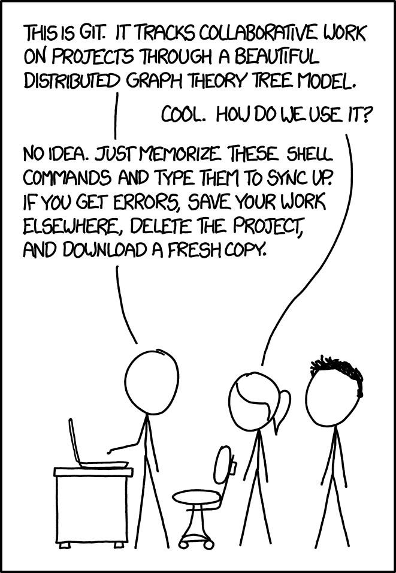

# Git fundamentals and workflows

This project and its contents are meant for anyone getting started with using `git` source control and looking to jump into it in a manner that will get them up to speed quickly and able to make practical changes to a project without being _too_ confused by all that stuff in the command line. It is aimed at the person who has work to be done yesterday, is new to `git`, and needs the real day-to-day workflow information and not too much more. As such there are MANY more advanced learnings out there on `git`, from books to online courses so treat this project as a starting point that will give the basics you need to expand into more advanced features.

The main goal will be to avoid this situation:



What we will cover:

- What is `git` and what problem does it solve?
- Making changes and using file states
- Exploring the history of how a file has changed
- Branching
- Synchronizing changes and merging
- Merge conflict resolution
- Storing projects (repos)
- Common ways to get yourself in trouble (and get out of trouble)
- Additional tools and "learning how to fish"

What we will NOT cover:

- Rebase / reflog AKA rewriting history
- Cherry picking
- Tagging
- Implementation details of how `git` tracks changes efficiently
- Forking and fork based workflows
- Git Submodules
- Any features beyond basic PRs specific to GitHub, Bitbucket, or GitLab

This guide will however give you the basic fundamentals needed to explore these more advanced features.

This doc will also teach `git` in a "command line first" manner. I do this not to seem like a self important CLI elitist, but because every tool that sits over `git` and gives visualization to make it more intuitive is itself interacting with `git` in the same way in the background reformatting the output for you. As such, understanding the basic CLI commands will also make those higher level tools even more intuitive and powerful to you, regardless of which one you use and preventing you from being reliant on a single editor or source control tool, especially because in modern software development it is very common to interact with source code on a variety of machines, platforms, and environments. You might work with some code locally on a Mac, and then also need to interact with that code on a remote linux server or Docker container with no GUI. You might have a coworker on a Windows machine with a very different editor than you. But in all these situations you'll have the same CLI interface available to you. So open up that terminal and lets get going.

## What is git and what problem does it solve?

### Why?

Have you ever been working on a document and realized you needed to make changes to it but you didn't really want to change the original? Maybe you have a draft version that you want to preserve but need to start working on a final copy so you make a copy called "term_paper.doc". Then you realize you need a new section to potentially take the paper in a new direction, so make another copy called "term_paper_extra.doc" but you also delete a few things while you're at it and fix a few spelling mistakes. Then you realize you like that version but it needs to be reorganized so now you have _yet another copy_ called "term_paper_final.doc". You realize 30 minutes later this didn't really justify another copy so you copy paste it all into the old one and delete it. At some point in editing however you forgot to copy a section from the draft version so you copy everything into the draft copy and rework it again and rename the file "draft_final_final.doc". But wait that thing you deleted was actually important and you now need to rewrite it, and top things off the professor for your class just emailed you saying it's now part of a group project and other people need to work on a copy of your paper....

You now don't have a project, you have a disaster.

Working on computer programming code is akin to group gardening crossed with being a lawyer who studied too many classical logic courses. Keeping track of all the changes and updates to files and their contents, and not just your own but other peoples is not sustainable using traditional document management like the above example. This is the problem that source control is designed to solve, and `git` is currently the most performant, and ubiquitous source control technology on the planet.

### What is it?

### A brief historical tangent

`git` is a Version Control System (VCS). There have been many such technologies since the move to digital computing to manage source code once we left punch cards in the literal dust, but nowadays `git` is by far the most used and arguably the best VCS system. It was originally developed by Linus Torvalds for working on the kernel of the Linux operating system, which was a sufficiently challenging and distributed project that existing VCS systems were proving too limited in terms of performance and features combined with a snafu involving licensing of the previous VCS system that forced Linus to find a new solution. As a result he made his own VCS system.

The name "git" is a play on the British definition of the word for "an unpleasant person" and according to Linus himself:

> I'm an egotistical bastard, and I name all my projects after myself. First 'Linux', now 'git'.
>
> - Linus Torvalds

### Git and Github

`git` and GitHub are not the same thing and `git` does not require the use of GitHub. Git refers only to the free open source tool used to track changes in a project and can be used entirely separate from GitHub, BitBucket, GitLab, or any other website/ service. You can self host remote `git` servers if you want instead of using GitHub. GitHub and Bitbucket are larger tools that wrap around `git` to provide enhanced collaboration capabilities, visualization, social code sharing and discovery for the open source community, and project management integrations for large groups.

### How git tracks changes

In a very simplified sense, `git` tracks the changes in your project in "snapshots" known as commits. Each commit contains information on the state of all files in your project, but does so in a way that is incredibly efficient in terms of storage and computation needs. Old VCS systems had severe performance problems the more branches and changes that existed in a project, but not so with `git`.

**IF YOU READ NOTHING ELSE IN THIS SECTION READ THIS**. The details of how exactly `git` tracks changes over time will probably not effect you except for one. _Git does NOT directly track the changes of files relative to their past versions in each commit_. This is known as "tracking deltas" and it was the cause of many performance and useability issues with past VCS systems which implemented it. Deltas and code diffs are _generated_ on demand by comparing commits identified via their hash code representations which themselves "only" contain all file data in the project at the time of a commit. Read that again. This may sound obsessively detailed and unimportant but there is one situation around branching later on where this detail may result in unintuitive results when viewing file changes and that situation is hardly uncommon. More on this later. For now just remember: _git does not track deltas directly in each commit, it tracks the total projects current state at that time._

### Design principle

In computer programming there are two relative ways to classify a programming language or tool, declarative and imperative. These are also sometimes called implicit and explicit programming respectively although some may argue more specific definitions of those words. In common discourse they're used interchangeably and I will do so here. `git` is an example of imperative / explicit tool. `git` will do nothing without you telling it to. All features must be invoked by the user and solutions to problems like merge conflicts must also be handled in every detail by the user. It will not autosave your work for example without you telling it to save your work or developing some auto commit system yourself.

A declarative / implicit programming language would be one like SQL where you tell the SQL engine what data to select and under what conditions, but the exact details of _how_ it gathers and returns said data is left up to the SQL engine, and different SQL engines do it differently. Kubernetes would be another such declarative system along with Google Drive.

This design choice means that `git` has a bit of a learning curve and can feel unfriendly to the user at first. The first time you see a merge conflict in raw text form you will probably want to test the aerodynamics of your laptop. However, by treating you the user as the absolute master of each action on the system, this gives you a great deal of flexibility and control in how you work with your files _without surprises_. `git` does not hold your hand, it treats you as an expert by default, for better or for worse. The good news is that its very difficult to truly lose or change a file beyond the repair of a `git` expert once that file has been initially tracked as you will see that _`git` rarely truly deletes anything, it just adds new data._

## Onwards

Speaking of changing files, lets get into doing meaningful work with `git`. Open up `2-making_changes.md`. You can do this quickly with VS Code via

```bash
code 2-making_changes.md
```
